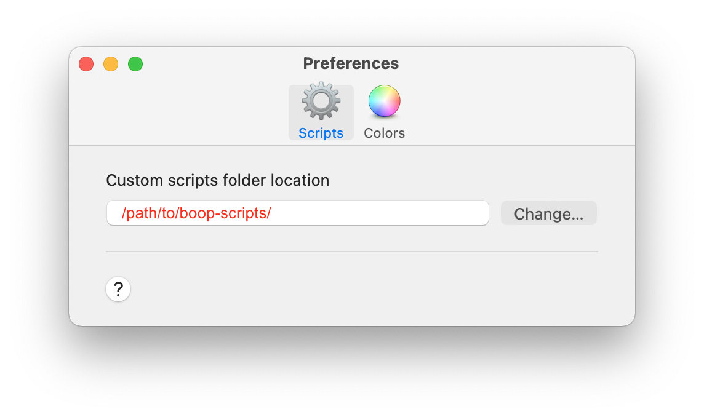
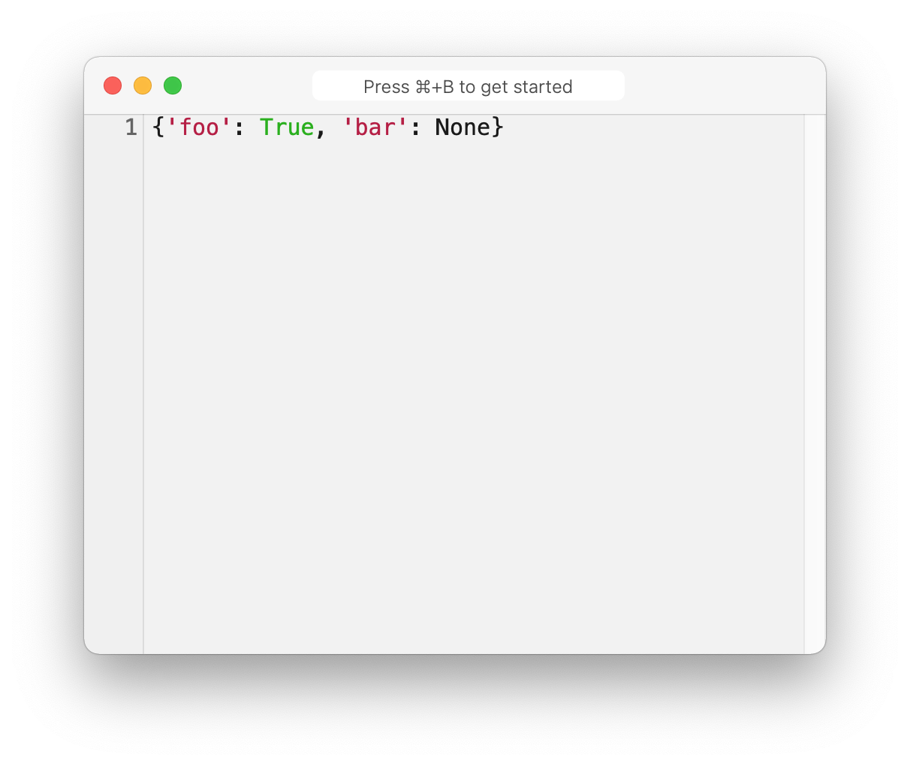
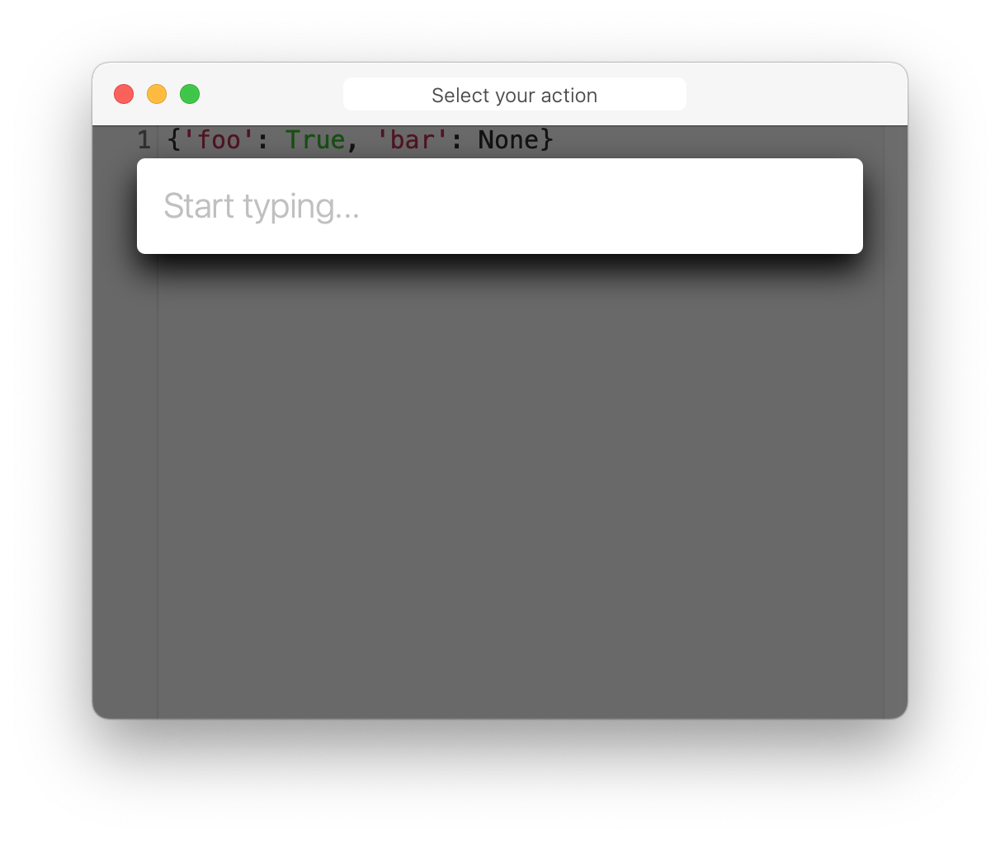
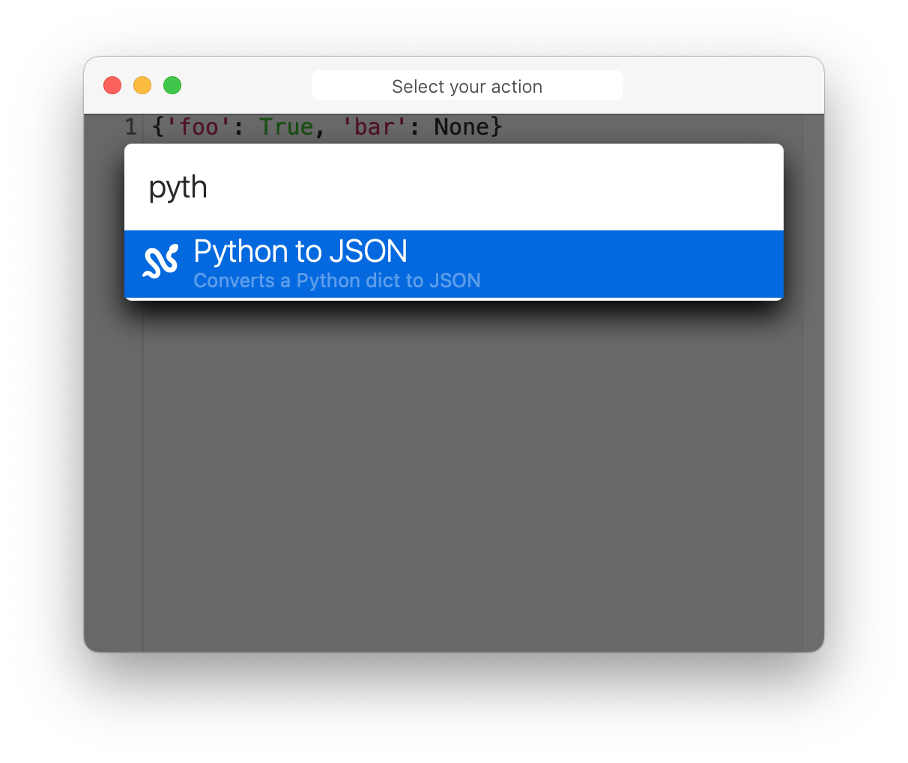
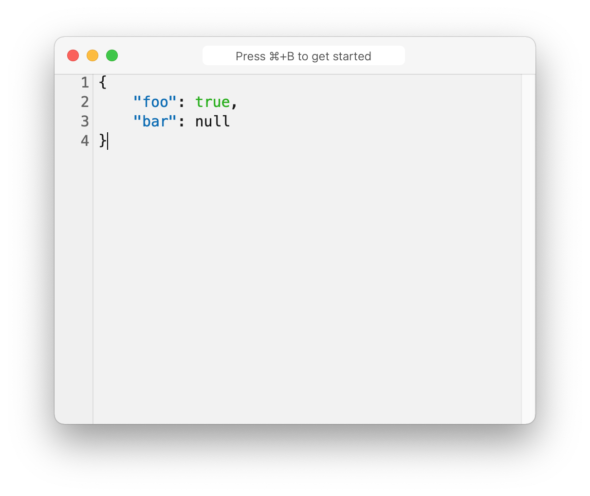

# boop-scripts

Custom scripts for Boop (https://github.com/IvanMathy/Boop)


## Installation

Clone this repo locally, and then point Boop to the local directory:



## Scripts
#### Python to JSON

This script will convert a python dict, as printed to the console, into JSON. This is useful when switching between the python shell and JS - you can copy the dict and then convert it. It is _very_ simplistic - it converts `True` to `true`, `None` to `null`, and `'` to `"`.

```python
>>> dict(foo=True, bar=None)
{'foo': True, 'bar': None}
```

Will convert in Boop to:

```javascript
{
    "foo": true,
    "bar": null
}
```

#### Usage





